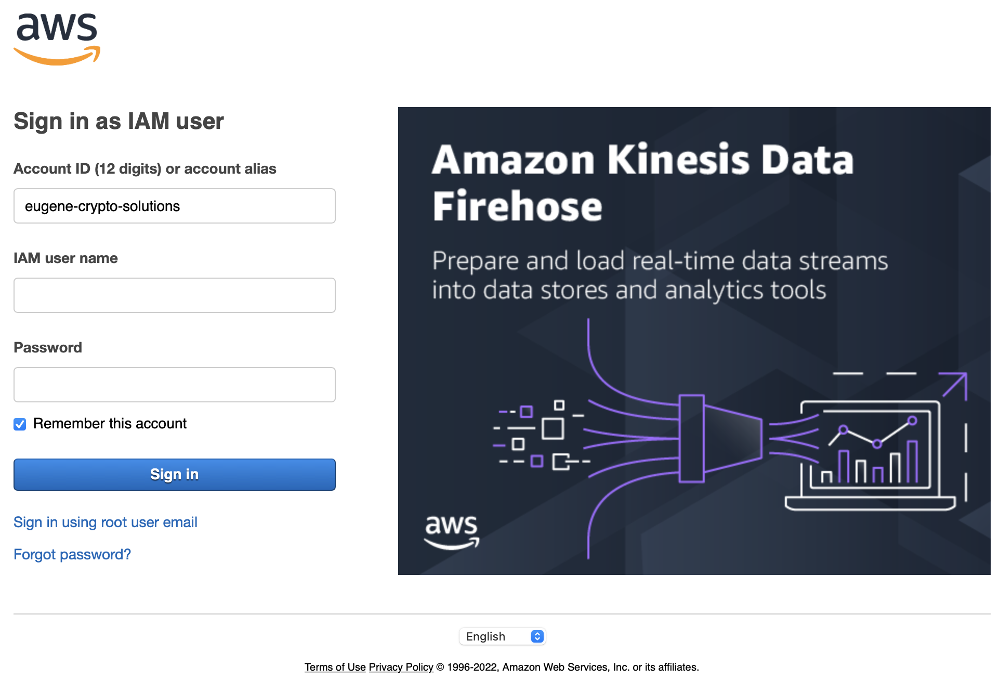
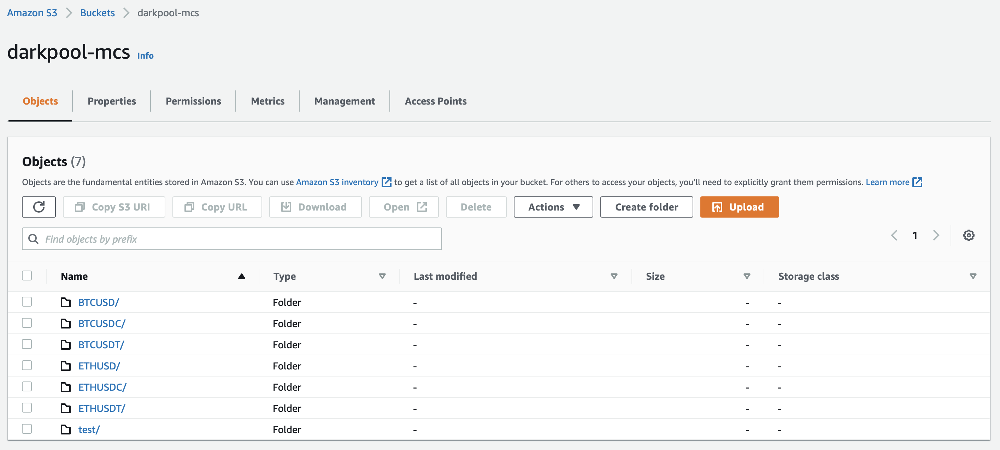
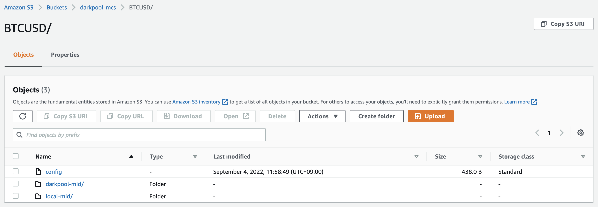
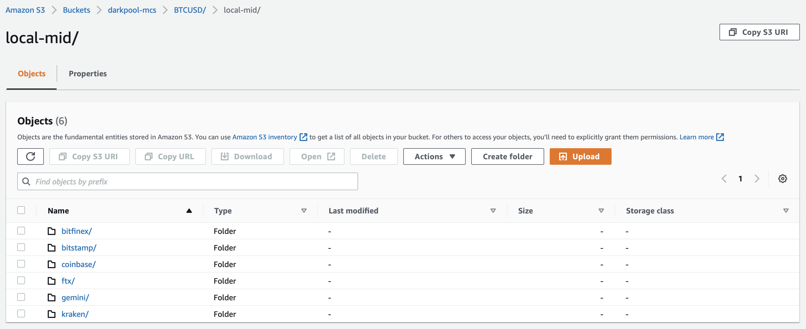
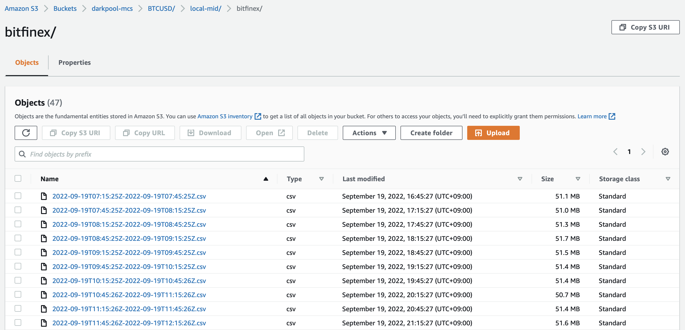
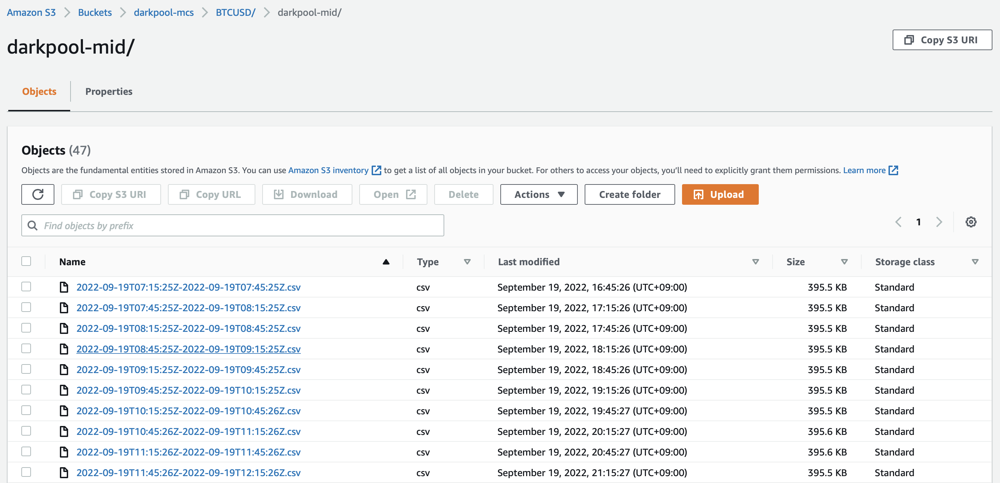

# Mid Database Access Guide

There are two ways to access AWS services

1. AWS Console
2. AWS CLI(Command Line Tools)

## AWS Console

Click [here](https://s3.console.aws.amazon.com/s3/buckets/darkpool-mcs?region=ap-east-1&tab=objects) to access AWS S3 storage.

### Sign In

Then it will ask you to sign in. Put the provided username and password.
At first access, AWS will ask you to change your password.



### Asset Pair

At the top level of storage, you can find a number of folders.
Each folder represents an asset pair(ex. BTCUSD).
Please ignore test.

Every data related to the asset pair is in associated folder.



### Data Type

If you navigate into a folder, you can see three objects.



* config \
this contains configurations of the mid constructor. \
ex. mid construction interval, assigned weigth for each exchange(ex. Binance)
* darkpool-mid \
`darkpool-mid` is the term we use to call mid data constructed by us.
Every darkpool-mid of this asset pair is stored here.
* local-mid \
`local-mid` is the term we use to call mid data derived from the orderbook, which is received from several exchanges (ex. Binance).
Every orderbook data and local-mid of this asset pair is stored here.

### Local Mid

If you navigate into a folder, you can see a number of folders.



Each folder represents an exchange.
Every orderbook data and local-mid is stored in associated folder.

### Exchanges

If you navigate into a folder, you can see many csv files.



Each csv file contains orderbook and local-mid.
Each file contains data for 30 minutes.
You can choose a file and click download.

**NOTE** Unfortunately you are not able to download multiple files at once.
If you want to, please use AWS CLI.

### Darkpool Mid

If you navigate into a folder, you can see many csv files.



Each csv file contains darkpool-mid.
Each file contains data for 30 minutes.
You can choose a file and click download.

**NOTE** Unfortunately you are not able to download multiple files at once.
If you want to, please use AWS CLI.

## AWS CLI

We recommend you to use AWS CLI rather than console.
It offers you more flexible interface.

### What is CLI?

This section is for those who are not familiar to shell / terminal / command line.
If you know what those mean and how to use them, you can skip this section.
Linux and MacOS users must be familiar to CLI.

A computer offers two interfaces to user: Graphic User Interface(GUI) and Command Line Interface(CLI).

GUI is what you see on the screen. Several icons on desktop, file explorer, etc.
GUI provides user convenience and intuition to manipulate computer system.

On the other hand, Command Line Interface consists of commands.
Command is a set of sentence which follows the pre-defined syntax so that the computer system can understand.

Usually these commands are used in the shell.
Shell is a program that receives a command from the user and executes.
There are various kinds of shell program, such as `bash`, `zsh`, etc.

And finally, shells run on terminal.

You can open terminal by pressing `Ctrl` + `Alt` + `T` on linux, by searching terminal app on MacOS, and by pressing `Win` + `R` on windows and running `cmd`.

### Installation

See the installation guide below.

[Installation Guide](https://docs.aws.amazon.com/cli/latest/userguide/getting-started-install.html)

### Setup AWS Credential

Open the terminal and execute the command below

```sh
aws configure
```

Then it will ask you to enter your information.

* AWS Access Key ID: enter the provided access key id.
* AWS Secret Access Key: enter the provided secret access key.
* Default region name: enter `ap-east-1`.
* Default output format: just press enter.

### Download Example

A command for download follows the syntax below.
Open the terminal and execute the command.

```sh
aws s3 cp <Uri> <LocalPath> [<option>]
```

This will copy an object from `<Uri>` to `<LocalPath>` with `<option>`.

Please remember the file system structure in the storage, mentioned above.
Uri of the object in the storage will follow the structure.

In all of the example below, destination of download is `darkpool` folder in `Desktop`.

* Ex. BTCUSD, darkpool-mid \
`aws s3 cp s3://darkpool-mcs/BTCUSD/darkpool-mid Desktop/darkpool --recursive` \
download entire contents(csv files) in `BTCUSD/darkpool-mid`.
* Ex. ETHUSDC, local-mid, bitfinex \
`aws s3 cp s3://darkpool-mcs/ETHUSDC/local-mid/bitfinex Desktop/darkpool --recursive` \
download entire contents(csv files) in `ETHUSDC/local-mid/bitfinex`.
* Ex. BTCUSDT, local-mid, binance \
`aws s3 cp s3://darkpool-mcs/BTCUSDT/local-mid/binance Desktop/darkpool --recursive` \
download entire contents(csv files) in `BTCUSDT/local-mid/binance`.
